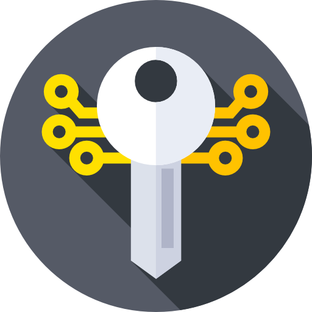
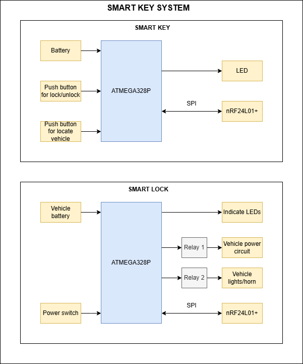

 

# Smart Key System

Smart Key system is a project for Embedded Systems course at HCMUT that aims to be a affordable solution to
bring some smart functions back to some old motorcycles. The system consist of 2 subsystems according to a 
key and a lock respectively.

## Specification

### Requirment table

[Requirement table](https://docs.google.com/spreadsheets/d/1nUn6pa3cHQUdWSz3ERi9wC6BmqBU7rnba5peyX5WJQM/edit?usp=sharing) 

### Components

- This project requires below coponents:

| Components | Quantity | Feature |
| ---------- | :------: | ------- |
| `nRF24L01+` RF module | 2 | <ul> <li> Work at 2.4 GHz frequency </li> <li> Communicate with MCU via SPI protocol </li> <li> Auto acknowlegdenment when transmitting </li> <li> Controlable transmitting power </li>  <li> Great range </li> <li> Wide operating voltage </li> <li> Ultra low power down consumption </li> </ul> |
| `ATMEGA328P` MCU | 2 | <ul> <li> Wide availibility </li> <li> Support several communication protocol: UART, SPI, I2C </li> <li> Have a good amount of GPIO pin (2 pins for buttons, 3 pins for indicating LEDs, and 6 pins for comminucation with RF module) </li> <li> Have lots of documentation and a large community </li> <li> Simple to configure and program </li> <li> Ultra low power consumption </li> <li> Operate under a wide voltage range </li> |
| `CR2450` battery | 1 | <ul> <li> Small size </li> <li> Geat voltage consistency (3V) </li> <li> Discharge voltage of 2V </li> <li> Good capacity of 600 mAh </li> </ul> |
| Push button | 2 | <ul> <li> Alway off push button </li> </ul> |
| Relay | 2 | <ul> <li> Able to handle high power </li> </ul> |
| RGB LED | 2 | <ul> <li> Simple to implement and program </li> <li> Wide available </li> </ul> |

Others electric components like resistors, conductors, capacitors, etc would be added later
at the end of this project.

- 🔑 **Smart Key** requirement list:

| Components | Quantity | Function |
| ------------- | :-------------: | ------------- |
| `nRF24L01+` RF module | 1 | RF transmiting and receiving |
| Push button | 2 | One for locating the vehicle (flashing light, horn) and one for locking the vehicle |
| `CR2450` battery | 1 | Power supplying |
| `ATMEGA328P` MCU | 1 | Controlling|

- 🔒 **Smart Lock** requirement list:

| Components | Quantity | Function |
| ------------- | :-------------: | ------------- |
| `nRF24L01+` RF module | 1 | RF transmitting and receiving |
| Multicolor LEDs | 1 | Indicating device working mode |
| Relay | 2 | One for controlling the vehicle's power and one for vehicle's light |
| `ATMEGA328P` MCU | 1 | Controlling |

### Block diagram

 

## 💁 Our members

|     | Names | IDs |
| ------------- | -------------- | -------------- |
| 1 | Luong Thanh Vy | 2151280 |
| 2 | Nguyen Cuong Quoc | 2251045 |
| 3 | Pham Tan Quang | 2151248 |

